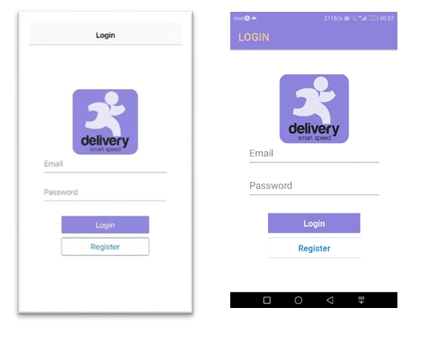
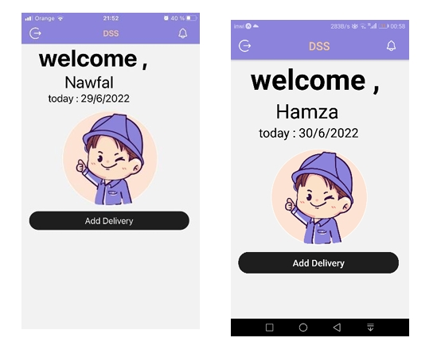
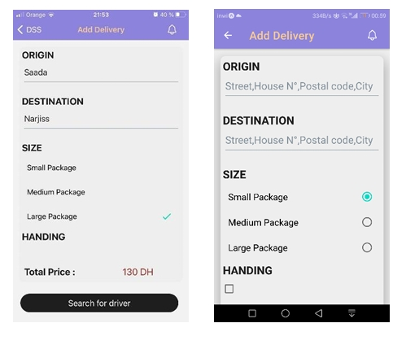
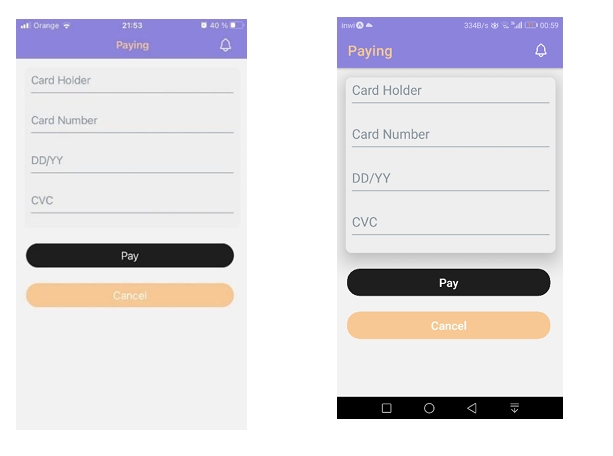

# Mobile Delivery App 🚚

> **Final Year Graduation Project (PFE)**
> **Licence Degree of Mathematical and Computer Sciences**
> *Université Chouaib Doukkali - Faculty of Sciences El Jadida*

## 📱 Project Overview
This project is a dynamic mobile application designed to manage the delivery process from A to Z. It addresses common logistical problems such as wasted time, the inability to track items, and the difficulty of finding available delivery workers.

The application serves three distinct types of users:
1.  **Customers:** Can create delivery requests, track packages, and process payments.
2.  **Drivers (Employees):** Receive delivery requests, view pickup details, and mark deliveries as complete.
3.  **Administrators:** A dashboard to manage customers, drivers, and oversee the entire delivery process.

## 📸 Screenshots
<p align="center">
  
  
  
  
</p>

## ✨ Key Features

### 👤 Customer Section
* **Authentication:** Secure login and registration (Sign up/Sign in).
* **Create Request:** Input package details (size, content), pickup location, and destination.
* **Real-time Cost:** View estimated delivery price before confirming.
* **Payment:** Secure interface for processing payments.

### 🚚 Driver Section
* **Receive Requests:** Instant notifications for new delivery jobs.
* **Job Details:** View pickup time and package information.
* **Validation:** Mark deliveries as complete to ensure payment.

### 💻 Administrator Dashboard
* **User Management:** Add, modify, or delete Customer and Driver accounts.
* **Request Oversight:** View all delivery requests and status.
* **Approvals:** Validate new driver registration requests.

## 🛠 Technologies Used

This project was built using the **React Native (Expo)** framework.

* **Frontend:** React Native, React JS, JSX
* **Backend / Database:** Firebase (Firestore, Auth)
* **Navigation:** React Navigation (Native Stack)
* **UI Components:** React Native Paper, React Native Elements (@rneui/themed), Expo Vector Icons
* **Package Manager:** NPM
* **Editor:** Visual Studio Code

## 🚀 How to Run the Project

### 1. Clone the Repository
```bash
git clone [https://github.com/YOUR_USERNAME/mobile-delivery-app.git](https://github.com/YOUR_USERNAME/mobile-delivery-app.git)
cd mobile-delivery-app
````

### 2\. Install Dependencies

Install the node modules required for the project.

```bash
npm install
```

### 3\. Configure Firebase

To run this app, you must provide your own Firebase credentials.

1.  Open the file `fireBase.js`.
2.  Replace the placeholder values with your own API keys from the [Firebase Console](https://console.firebase.google.com/):
    ```javascript
    const firebaseConfig = {
        apiKey: "YOUR_API_KEY",
        authDomain: "YOUR_PROJECT_ID.firebaseapp.com",
        projectId: "YOUR_PROJECT_ID",
        storageBucket: "YOUR_PROJECT_ID.appspot.com",
        messagingSenderId: "YOUR_SENDER_ID",
        appId: "YOUR_APP_ID"
    };
    ```

### 4\. Start the Application

Use Expo to run the app on a simulator or your physical device.

```bash
npx expo start
# or
npm start
```

  * **Android:** Press `a` in the terminal.
  * **iOS:** Press `i` in the terminal.
  * **Physical Device:** Scan the QR code using the Expo Go app.

## 🔮 Future Improvements

the following features are planned for future updates:

  * **Online Payment Integration:** Implementing a fully functional payment gateway (Stripe/PayPal).
  * **Cross-Platform Optimization:** Enhancing management for specific iOS/Android native features.
  * **Live Tracking:** Integrating map APIs for real-time driver tracking on a map.

## 🎓 Credits

**Author:** Soufiane Benhabboul
**Supervisor:** Prof S. El Houssaini
**Institution:** Faculty of Sciences, El Jadida - Université Chouaib Doukkali
